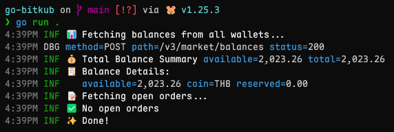

# Bitkub Go SDK

[](https://github.com/dvgamerr-app/go-bitkub/actions/workflows/testing.yml)
[](https://golang.org/)
[](LICENSE)
[](https://discord.gg/QDccF497Mw)

Go SDK for [Bitkub](https://www.bitkub.com/) Cryptocurrency Exchange API - Complete implementation with full V3 & V4 API support + **Command Line Interface**



## Quick Start:
```bash
# Install via go install
go install github.com/dvgamerr-app/go-bitkub/cmd/bitkub@latest

# Get market ticker
bitkub market ticker

# Get BTC price
bitkub market ticker btc_thb

# Get historical data
bitkub market history btc_thb --resolution 1

# Output in different formats
bitkub market ticker --format json   # JSON output
bitkub market ticker --format jsonl  # JSONL output (one JSON per line)
bitkub market ticker --format text   # Text output (default)

# Get your balance (requires API keys)
bitkub -k YOUR_KEY -s YOUR_SECRET market balances
```

## ⚠️ Important Updates

This SDK implements the latest Bitkub API V3 specification (November 2025) with:
- ✅ All deprecated endpoints removed
- ✅ Using V3 endpoints exclusively
- ✅ Keyset-based pagination (page-based removed)
- ✅ Simplified function names (removed V3 suffix)
- 🆕 **CLI Tool with Cobra & Zerolog**

## 🚀 Features

### 🖥️ Command Line Interface (NEW!)
A powerful CLI tool for interacting with Bitkub API from the terminal:
- ✅ All API endpoints accessible via commands
- ✅ Beautiful logging output with zerolog
- ✅ Multiple output formats (JSON, JSONL, Text)
- ✅ Support for .env configuration
- ✅ Market commands including historical data (31+ total)
- ✅ Crypto commands (7 total)
- ✅ Fiat commands (4 total)
- ✅ User commands (3 total)

**Documentation:**
- 📖 [Installation Guide](INSTALL.md) - Detailed installation instructions
- 📖 [CLI Documentation](CLI.md) - Complete CLI reference with examples

### WebSocket Streaming (Real-time) 🔴
- ✅ Market trade stream
- ✅ Market ticker stream
- ✅ Live order book stream
- ✅ Multiple streams subscription
- ✅ Auto-reconnect with configurable retry
- ✅ Graceful shutdown & error handling

#### CLI Streaming Examples
```bash
# Trade stream (5 messages default)
bitkub stream trade thb_btc

# Ticker stream continuous
bitkub stream ticker thb_btc -t

# JSONL output
bitkub --format jsonl stream trade thb_btc -n 2

# JSON array output
bitkub --format json stream ticker thb_btc -n 5
```

### Market API (V3)
- ✅ Non-secure endpoints (Market data, server status)
- ✅ Secure endpoints (Trading, user info, fiat operations)
- ✅ Historical data for TradingView charts
- ✅ WebSocket token support
- ✅ Full order management (place, cancel, history)
- ✅ Wallet & balance operations
- ✅ Real-time ticker and trade data

### Crypto API (V4) ✨
- 📋 List crypto addresses with pagination
- ➕ Generate new crypto addresses
- 💰 View deposit history
- 💸 View withdrawal history
- 🚀 Create withdrawals to trusted addresses
- 🪙 Get available coins and networks
- 🎁 View compensations history

### Core Features
- ✅ Type-safe API responses
- ✅ Proper error handling
- ✅ Connection pooling & optimization
- ✅ HMAC SHA256 signature authentication
- ✅ Rate limit awareness

## 📦 Installation

```bash
go get github.com/dvgamerr-app/go-bitkub
```

## 🔧 Quick Start

### Initialize

```go
package main

import (
    "log"
    "github.com/dvgamerr-app/go-bitkub/bitkub"
    "github.com/dvgamerr-app/go-bitkub/market"
)

func main() {
    // Initialize with API credentials
    bitkub.Initlizer("YOUR_API_KEY", "YOUR_SECRET_KEY")
    // Or use environment variables BTK_APIKEY and BTK_SECRET
    bitkub.Initlizer()
    
    // Get wallet balance
    wallet, err := market.GetWallet()
    if err != nil {
        log.Fatal(err)
    }
    log.Printf("Wallet: %+v", wallet)

    // Get detailed balances
    balances, err := market.GetBalances()
    if err != nil {
        log.Fatal(err)
    }
    log.Printf("Balances: %+v", balances)
}
```

## 📚 API Coverage

### Non-Secure Endpoints (V3)

```go
import (
    "github.com/dvgamerr-app/go-bitkub/bitkub"
    "github.com/dvgamerr-app/go-bitkub/market"
)

// Get system status
status, err := bitkub.GetStatus()

// Get server time
timestamp, err := bitkub.GetServerTime()

// Get all symbols
symbols, err := market.GetSymbols()

// Get ticker data
tickers, err := market.GetTicker("btc_thb")

// Get market depth
depth, err := market.GetDepth("btc_thb", 10)

// Get recent trades
trades, err := market.GetTrades("btc_thb", 10)

// Get historical data for TradingView
history, err := market.GetHistory(market.HistoryRequest{
    Symbol:     "btc_thb",
    Resolution: "60",  // 1, 5, 15, 60, 240, 1D
    From:       1234567890,
    To:         1234567890,
})

// Get buy orders (bids)
bids, err := market.GetBids("btc_thb", 10)

// Get sell orders (asks)
asks, err := market.GetAsks("btc_thb", 10)
```

### Trading Endpoints (V3 - Secure)

```go
import "github.com/dvgamerr-app/go-bitkub/market"

// Get wallet balances
wallet, err := market.GetWallet()

// Get detailed balances
balances, err := market.GetBalances()

// Place buy order
bidReq := market.PlaceBidRequest{
    Symbol:   "btc_thb",
    Amount:   1000,
    Rate:     2500000,
    Type:     "limit",
    ClientID: "order-1",
}
bidResult, err := market.PlaceBid(bidReq)

// Place sell order
askReq := market.PlaceAskRequest{
    Symbol: "btc_thb",
    Amount: 0.001,
    Rate:   2600000,
    Type:   "limit",
}
askResult, err := market.PlaceAsk(askReq)

// Cancel order
cancelReq := market.CancelOrderRequest{
    Symbol: "btc_thb",
    ID:     "12345",
    Side:   "buy",
}
err = market.CancelOrder(cancelReq)

// Get open orders
orders, err := market.GetOpenOrders("btc_thb")

// Get order history (with keyset pagination)
historyParams := market.OrderHistoryParams{
    Symbol: "BTC_THB",
    Limit:  "10",
}
orderHistory, err := market.GetOrderHistory(historyParams)

// Get order info
orderInfo, err := market.GetOrderInfo("btc_thb", "12345", "buy")

// Get WebSocket token
token, err := market.GetWSToken()
```

### User Endpoints (V3 - Secure)

```go
import "github.com/dvgamerr-app/go-bitkub/user"

// Get trading credits
credits, err := user.GetTradingCredits()

// Get user limits
limits, err := user.GetUserLimits()

// Get coin convert history
convertParams := user.CoinHistoryParams{
    Page:   1,
    Limit:  100,
    Status: "success",
}
convertHistory, err := user.GetCoinConvertHistory(convertParams)
```

### Fiat Endpoints (V3 - Secure)

```go
import "github.com/dvgamerr-app/go-bitkub/fiat"

// Get bank accounts
accountsParams := fiat.AccountsParams{
    Page:  1,
    Limit: 10,
}
accounts, err := fiat.GetAccounts(accountsParams)

// Withdraw fiat
withdrawReq := fiat.WithdrawRequest{
    ID:     "bank-account-id",
    Amount: 1000.0,
}
withdrawResult, err := fiat.Withdraw(withdrawReq)

// Get deposit history
depositParams := fiat.DepositHistoryParams{
    Page:  1,
    Limit: 10,
}
deposits, err := fiat.GetDepositHistory(depositParams)

// Get withdrawal history
withdrawParams := fiat.WithdrawHistoryParams{
    Page:  1,
    Limit: 10,
}
withdrawals, err := fiat.GetWithdrawHistory(withdrawParams)
```

### Crypto API (V4) Examples

```go
import "github.com/dvgamerr-app/go-bitkub/crypto"

// List crypto addresses with pagination
addresses, err := crypto.GetAddresses(crypto.Addresses{
    Page:    1,
    Limit:   10,
    Symbol:  "ATOM",
    Network: "ATOM",
})

// Create new crypto address
newAddresses, err := crypto.CreateAddress(crypto.CreateAddressRequest{
    Symbol:  "BTC",
    Network: "BTC",
})

// Get deposit history with filters
deposits, err := crypto.GetDeposits(crypto.Deposits{
    Page:   1,
    Limit:  10,
    Symbol: "BTC",
    Status: "complete",
})

// Get withdrawal history
withdrawals, err := crypto.GetWithdraws(crypto.Withdraws{
    Page:   1,
    Limit:  10,
    Symbol: "BTC",
})

// Get available coins
coins, err := crypto.GetCoins(crypto.Coins{
    Symbol: "BTC",
})

// Withdraw crypto
withdrawReq := crypto.CreateWithdrawRequest{
    Symbol:  "BTC",
    Network: "BTC",
    Address: "bc1q...",
    Amount:  0.001,
    Memo:    "",
}
txn, err := crypto.CreateWithdraw(withdrawReq)

// Get compensations history
compensations, err := crypto.GetCompensations(crypto.Compensations{
    Page:  1,
    Limit: 10,
})
```

## 📖 Documentation

- [Official Bitkub V3 API](https://github.com/bitkub/bitkub-official-api-docs/blob/master/restful-api.md)
- [Official Bitkub V4 API](https://github.com/bitkub/bitkub-official-api-docs/blob/master/restful-api-v4.md)

## 🔒 Security Best Practices

1. **Never commit API keys** to version control
2. **Use environment variables** for credentials:
   ```bash
   export BTK_APIKEY="your_api_key"
   export BTK_SECRET="your_secret_key"
   ```
3. **Use IP whitelist** in Bitkub API settings
4. **Implement rate limiting** in your application
5. **Monitor API usage** regularly

## ⚡ Rate Limits

| Endpoint Type | Rate Limit |
|---------------|------------|
| Market Data V3 (ticker, trades, etc.) | 100 req/sec |
| Trading Operations | 150-200 req/sec |
| Fiat/User Operations | 20 req/sec |
| Crypto V4 Operations | 250 req/10sec |

See [official documentation](https://github.com/bitkub/bitkub-official-api-docs/blob/master/restful-api.md#rate-limits) for complete information.

## 🧪 Testing

### Run Tests (Requires API credentials)
```bash
# Set your credentials
export BTK_APIKEY="your_api_key"
export BTK_SECRET="your_secret_key"

# Run tests
go test ./... -v
```

## 📁 Project Structure

```
go-bitkub/
├── bitkub/          # Core API client and authentication
│   ├── bitkub.go    # Initialization and configuration
│   ├── fetch.go     # HTTP client with v3 & v4 support
│   ├── error.go     # Error code mappings
│   ├── status.go    # System status endpoints
│   └── types.go     # Common type definitions
├── market/          # Market API (V3) endpoints
│   ├── symbols.go
│   ├── ticker.go
│   ├── depth.go
│   ├── trades.go
│   ├── bids.go
│   ├── asks.go
│   ├── place-bid.go
│   ├── place-ask.go
│   ├── cancel-order.go
│   ├── order-history.go
│   ├── order-info.go
│   ├── balances.go
│   ├── wallet.go
│   └── wstoken.go
├── user/            # User API (V3) endpoints
│   ├── trading-credits.go
│   ├── limits.go
│   └── coin-convert-history.go
├── fiat/            # Fiat API (V3) endpoints
│   ├── accounts.go
│   ├── withdraw.go
│   ├── deposit-history.go
│   └── withdraw-history.go
├── crypto/          # Crypto API (V4) endpoints
│   ├── addresses.go
│   ├── deposits.go
│   ├── withdraws.go
│   ├── coins.go
│   ├── compensations.go
│   └── types.go
├── stream/          # WebSocket streaming (Real-time)
│   ├── stream.go          # Main stream client
│   ├── types.go           # Message types
│   ├── stream_test.go     # Tests
│   ├── README.md          # Stream documentation
│   └── examples/          # Usage examples
│       ├── market/        # Market stream example
│       ├── orderbook/     # Order book example
│       └── timeout/       # Timeout example
├── utils/           # Utility functions
│   ├── error.go
│   └── helper.go
├── balances.go      # Balance aggregation helper
├── wallet.go        # Wallet helper functions
└── docs/            # Documentation
```

## 📡 WebSocket Streaming

Real-time market data streaming with auto-reconnect support.

### Basic Usage

```go
import "github.com/dvgamerr-app/go-bitkub/stream"

// Create stream with default config
s := stream.New(nil)

// Connect to market streams
if err := s.ConnectMarket("market.trade.thb_btc", "market.ticker.thb_btc"); err != nil {
    panic(err)
}
defer s.Close()

// Read messages in loop
for msg := range s.Messages() {
    if msg.Error != nil {
        fmt.Printf("Error: %v\n", msg.Error)
        continue
    }
    
    fmt.Printf("[%s] %+v\n", msg.Type, msg.Data)
}
```

### Advanced Configuration

```go
config := &stream.StreamConfig{
    ReconnectInterval: 5 * time.Second,  // Wait before reconnect
    MaxReconnect:      10,                // Max reconnect attempts
    PingInterval:      30 * time.Second,  // Ping interval
    ReadTimeout:       60 * time.Second,  // Read timeout
}

s := stream.New(config)
```

### Available Streams

**Market Streams:**
- `market.trade.<symbol>` - Real-time trades
- `market.ticker.<symbol>` - Real-time ticker

**Order Book:**
```go
// Connect to order book (symbol ID: 1 = THB_BTC)
s.ConnectOrderBook(1)
```

See [`stream/README.md`](./stream/README.md) for complete documentation and examples.

## 🤝 Contributing

Contributions are welcome! Please feel free to submit a Pull Request.

## 📄 License

MIT License

## 🔗 Links

- [Bitkub Official Website](https://www.bitkub.com/)
- [Bitkub V3 API Documentation](https://github.com/bitkub/bitkub-official-api-docs/blob/master/restful-api.md)
- [Bitkub V4 API Documentation](https://github.com/bitkub/bitkub-official-api-docs/blob/master/restful-api-v4.md)
- [Bitkub WebSocket API Documentation](https://github.com/bitkub/bitkub-official-api-docs/blob/master/websocket-api.md)
- [Bitkub Support](https://support.bitkub.com/)

## ⚠️ Disclaimer

This is an unofficial SDK. Use at your own risk. Always test thoroughly before using in production.

---

**Note**: This SDK implements the Bitkub API specification as of November 2025. API specifications are subject to change by Bitkub.

